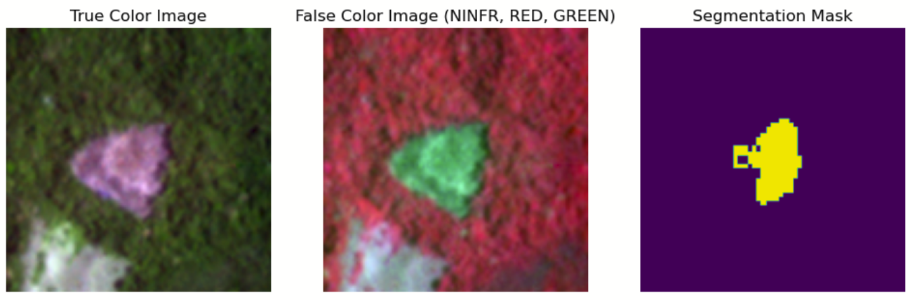
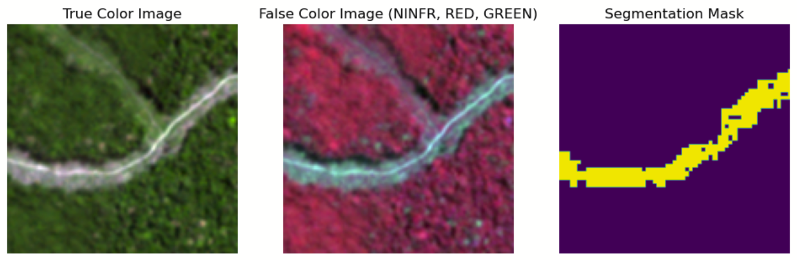

# Segment2Reforest
Project for the class on Image Processing for Earth Obsercation - EPFL, 2023
 : 
 

## Using this Repository
To code is structured as a package. To use this repository, you should first create a virtual enivronment to install the required dependencies as well as the repository itself. For instance with conda, run

```bash
conda create --name project_deforestation python=3.9
conda activate project_deforestation
pip install -r requirements.txt
pip install -e .
```

**Important**: Adjust the PATH_TO_DATA variable in the config/config.py file to point to the location of the data. 

## Recreating predictions

To run an example inference for one image, you can use the inference.ipynb notebook located in the root directory. 
To do so, you must download the final model weights via [this Google Drive Link](https://drive.google.com/file/d/1dhp23CvusZjCRKS8JMdcfMiPAkntjBqh/view?usp=sharing) and place the weights into the project's root directory.


## Dataset

The dataset is made available through the [`Norway's International Climate and Forests Initiative Satellite Data Program`](https://www.planet.com/nicfi/). The present work used a curated subset for training. The labels are sourced from the Integrated Alert System from the Global Forest Watch initiative (see a [short description here](https://www.globalforestwatch.org/blog/data-and-research/integrated-deforestation-alerts/)).


Two examples of the data can be seen below:





## File Structure

**Source Files:**
- **model**: Package directory for storing model implementations.
- **utils**: Package directory for utility functions and helper scripts.

**Notebooks:**
- **A. Data Exploration**
  - `A1_Explore_Data.ipynb`: Notebook for data exploration and testing the data loaders.
- **B. Model Training & Evaluation Notebooks**
  - `B0_MLE_benchmark.ipynb`: Notebook for creating and evaluating the benchmark model based on Multivariate Gaussian Maximum Likelhood Estimation.
  - `B1_Deeplabv3plus.ipynb`: Notebook for training and running experiments with the DeepLabv3+ Model.
  - `B2_MSNet.ipynb`: Notebook for training and running experiments with the MSNet Model.
  - `B3_UNet.ipynb`: Notebook for training and running experiments with the UNet Model.

**Setup & Configuration:**
- `config/config.py`: Configuration file to change path to data.
- `requirements.txt`: File specifying the Python dependencies.
- `pyproject.toml`: Project build file.
